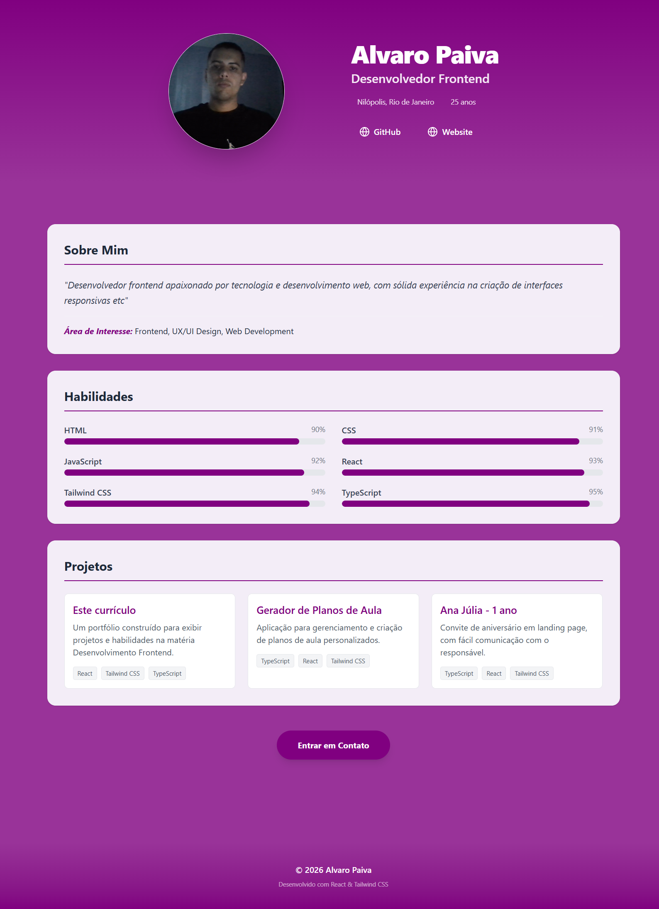

# Portfolio / Currículo (React + Tailwind CSS)

Este projeto é uma página pessoal de Portfolio / Currículo desenvolvida como parte da atividade de Desenvolvimento Frontend. Ele demonstra conceitos de React, arquitetura baseada em componentes e estilização com TailwindCSS.

## Como Executar o Projeto

Siga os passos abaixo para baixar, instalar e executar o projeto localmente:

### 1. Clonar o repositório
```bash
git clone https://github.com/1alvaropaiva/portfolio_dfro.git
cd portfolio_dfro
```

### 2. Instalar dependências
Certifique-se de ter o [Node.js](https://nodejs.org/) instalado.
```bash
npm install
```

### 3. Iniciar o servidor de desenvolvimento
```bash
npm run dev
```
A aplicação estará disponível em `http://localhost:5173`.

---

## Requisitos e Implementação

### 1. Criação e Organização de Componentes
O projeto está estruturado em componentes, organizados por suas funções (layout, seções e interface).

- **`App`**: O ponto de entrada principal que orquestra o layout.
- **`Header`**: Exibe o título profissional e informações de contato.
- **`About`**: Descrição pessoal e área de interesse.
- **`Skills`**: Lista de tecnologias com indicadores visuais.
- **`Projects`**: Grade de projetos com nomes, descrições e tecnologias utilizadas.
- **`Button`**: Um componente estilizado e reutilizável de botão para "Entrar em Contato".

**Estrutura de Arquivos:**
```text
src/
├── components/
│   ├── layout/       # Header, Footer
│   ├── sections/     # About, Skills, Projects
│   └── ui/           # Button, SectionCard
├── data/             # Dados estáticos (portfolioProps.ts)
└── types/            # Interfaces TypeScript
```

### 2. Uso de Props
Os dados são passados do componente principal `App` para os componentes filhos usando props do React, garantindo um fluxo de dados claro.

**Exemplo do arquivo `App.tsx`:**
```tsx
<About 
  fullName={portfolioProps.about.fullName}
  description={portfolioProps.about.description}
  interestArea={portfolioProps.about.interestArea}
/>
```

### 3. Estilização com Tailwind CSS

**Exemplo do arquivo `Button.tsx`:**
```tsx
<button 
  className="bg-primary hover:bg-primary-hover text-white font-bold py-4 px-10 rounded-full shadow-lg transform transition-all hover:scale-105 active:scale-95"
>
  {label}
</button>
```

## Tecnologias Utilizadas

- **React**: Biblioteca frontend.
- **Tailwind CSS**: Framework CSS utilitário.
- **TypeScript**: Tipagem estática para melhor experiência do desenvolvedor.
- **Vite**: Ferramenta moderna de build frontend.
---

## Visualização


